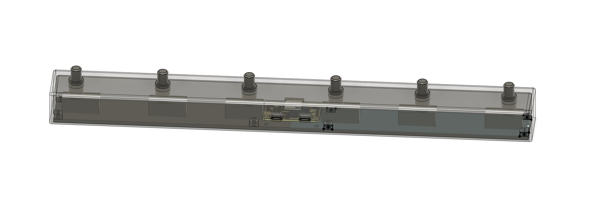

# FootController_X6 - ESP32 MIDI Footswitch Controller

[](enclosure/FootController_X6.step)
*(Click image to view/download the 3D enclosure STEP file)*

A customizable 6-switch USB MIDI footswitch controller based on the ESP32 microcontroller.

## Features

*   **6 Independent Footswitches:** Robust inputs for MIDI control.
*   **USB MIDI Class Compliant:** Works plug-and-play with computers and devices supporting USB MIDI.
*   **Multi-Layer Configuration:** Up to 5 layers, allowing each switch to send different MIDI messages depending on the active layer.
*   **Hold Actions:** Configure switches to perform actions when held down:
    *   Momentarily switch to another layer.
    *   Toggle between layers.
    *   Send a dedicated MIDI CC message.
*   **Toggle Mode:** Configure individual switches to act as latching toggles, sending different MIDI values for ON and OFF states.
*   **JSON Configuration via USB Serial:** Easily customize switch behavior (MIDI CC numbers/values per layer, hold actions, toggle settings) by sending a JSON configuration file over the USB CDC Serial port.
*   **Persistent Configuration:** Saves your custom configuration to the ESP32's non-volatile storage (NVS).
*   **ESP32 Powered:** Utilizes a powerful and versatile ESP32 microcontroller.
*   **Open Hardware:** Includes PCB design files and 3D enclosure model.
*   **(Planned) USB-C Port Controller:** Hardware includes a TUSB320 chip for potential future USB-C features (currently inactive in firmware).

## Hardware

*   **Microcontroller:** ESP32-S3 (Specific module TBD, e.g., ESP32-S3-WROOM-1)
*   **Switches:** 6 standard footswitches connected to GPIOs 4, 5, 6, 38, 47, 48.
*   **Connectivity:** USB (Type-C connector likely, given TUSB320) providing MIDI and Serial (CDC).
*   **PCB:** Custom PCB design (See `pcb/` directory. PCB Software TBD, e.g., Eagle, KiCad).
*   **Enclosure:** Custom 3D printable enclosure (See `enclosure/` directory and `assets/enclosure.png`).

## Known Issues & Planned Improvements

*   **PCB USB Routing:** The differential pair routing for the USB connection needs optimization for better signal integrity.
*   **ESD Protection:** The current ESD protection component is underrated for the operating voltage and exhibits current leakage. It needs to be replaced with a suitable component.
*   **TUSB320 Implementation:** The firmware needs to implement I2C communication with the TUSB320 USB-C controller to enable its features (currently planned/inactive).
*   **Power MUX:** The existing power multiplexer should be replaced with a simpler diode-based solution for power source selection/protection.

## Firmware

*   Based on ESP-IDF (Espressif IoT Development Framework).
*   Uses the TinyUSB library for USB device implementation.
*   Handles switch debouncing, layers, hold detection, and MIDI message generation.
*   Provides a USB CDC Serial interface for configuration updates.
*   See the [firmware/README.md](firmware/README.md) for specific firmware details and build instructions.

## Getting Started

### Prerequisites

*   ESP-IDF environment setup (refer to official Espressif documentation).
*   Software to send serial data (e.g., `minicom`, `screen`, Termite, PuTTY, Arduino IDE Serial Monitor).
*   (Optional) 3D printer if building the enclosure.
*   (Optional) PCB fabrication service if building the PCB.

### Building and Flashing

Instructions for building and flashing the firmware are located in the [firmware/README.md](firmware/README.md).

### Configuration

1.  Connect the FootController_X6 to your computer via USB. It should appear as both a MIDI device and a Serial (COM/tty) port.
2.  Open a serial terminal connection to the FootController's serial port (Baud rate usually doesn't matter for CDC, but use 115200 if required).
3.  Prepare your configuration in JSON format (see [Configuration Format](#configuration-format) below).
4.  Paste the entire JSON string into the serial terminal.
5.  **Crucially, add a `$` character immediately after the closing `}` of the JSON.** This signals the end of the configuration.
6.  Press Enter/Send. The ESP32 will parse the JSON, apply the configuration, and save it to NVS. Debug messages confirming the process should appear if you are monitoring the serial output via `idf.py monitor` or another terminal connected to the same port.

### Configuration Format

The configuration is a JSON object containing a single key `"config"`, which is an array of objects, each defining a footswitch.

**Footswitch Object:**

*   `id` (Integer, Required): The switch identifier (2-7, corresponding to GPIOs 4, 5, 6, 38, 47, 48 respectively). Switch ID 1 (GPIO 0) is ignored by default.
*   `layers` (Array, Required): An array of layer configuration objects (up to 5, defined by `MAX_LAYERS` in firmware). Index 0 is the base layer.
    *   **Layer Object:**
        *   `cc_number` (Integer, 0-127, Required): MIDI CC number to send for this switch on this layer.
        *   `cc_value` (Integer, 0-127, Required): MIDI CC value to send.
*   `hold_action` (String, Optional): Action to perform when the switch is held down (for `HOLD_TIME_MS` milliseconds). Options:
    *   `"midi"`: Send a specific MIDI message defined in `midi_cc`.
    *   `"momentary_layer"`: Temporarily switch to the layer defined in `target_layer` while held. Reverts to layer 0 on release unless another layer is locked.
    *   `"toggle_layer"`: Toggle between layer 0 and the layer defined in `target_layer`. Stays on the target layer until toggled back.
    *   (Default: No special hold action, MIDI sent on press/release as per `toggle` setting).
*   `midi_cc` (Object, Required if `hold_action` is `"midi"`): Defines the MIDI message for the hold action.
    *   `number` (Integer, 0-127, Required): MIDI CC number.
    *   `value` (Integer, 0-127, Required): MIDI CC value.
*   `target_layer` (Integer, 0-4, Required if `hold_action` is `"momentary_layer"` or `"toggle_layer"`): The layer index (0 to `MAX_LAYERS - 1`) to switch to.
*   `toggle` (Object, Optional): If present, configures the switch as a latching toggle instead of momentary.
    *   `on_value` (Integer, 0-127, Required): CC value to send when toggled ON (first press).
    *   `off_value` (Integer, 0-127, Required): CC value to send when toggled OFF (second press). *(Note: The `cc_number` from the active layer's `layers` configuration is used)*.

**Example JSON:**

```json
{
  "config": [
    {
      "id": 2, // Switch on GPIO 4
      "layers": [
        { "cc_number": 20, "cc_value": 127 }, // Layer 0
        { "cc_number": 21, "cc_value": 127 }  // Layer 1
      ],
      "hold_action": "momentary_layer",
      "target_layer": 1
    },
    {
      "id": 3, // Switch on GPIO 5
      "layers": [ { "cc_number": 22, "cc_value": 127 } ], // Layer 0 only
      "hold_action": "toggle_layer",
      "target_layer": 1
    },
    {
      "id": 4, // Switch on GPIO 6
      "layers": [ { "cc_number": 23, "cc_value": 0 } ], // CC number for toggle
      "toggle": { // Make this switch a toggle
        "on_value": 127,
        "off_value": 0
      }
    },
    {
      "id": 5, // Switch on GPIO 38
      "layers": [ { "cc_number": 24, "cc_value": 127 } ], // Sent on press (if not held)
      "hold_action": "midi",
      "midi_cc": { // Sent on hold instead of layer message
        "number": 99,
        "value": 127
      }
    },
    {
      "id": 6, // Switch on GPIO 47 - Simple momentary
      "layers": [ { "cc_number": 25, "cc_value": 127 } ]
    },
    {
      "id": 7, // Switch on GPIO 48 - Simple momentary
      "layers": [ { "cc_number": 28, "cc_value": 127 } ]
    }
  ]
}$
```
*(Remember the trailing `$` when sending via serial!)*

## Project Structure

```
.
├── assets/                 # Images, etc.
│   └── enclosure.png
├── enclosure/              # 3D Enclosure files
│   └── FootController_X6.step
├── firmware/               # ESP32 Firmware (ESP-IDF project)
│   ├── main/               # Main source code
│   │   ├── footswitch_controller.c # Core logic
│   │   ├── main.c            # App entry point, USB setup
│   │   └── ...
│   ├── CMakeLists.txt
│   └── README.md           # Firmware-specific details
├── pcb/                    # PCB Design files
│   └── midi_footswitch.eprj # (PCB Software TBD .eprj likely Eagle)
└── README.md               # This file
```

## Contributing

(Contributions welcome! Please specify guidelines if desired, e.g., pull requests, issue reporting.)

## License

MIT
